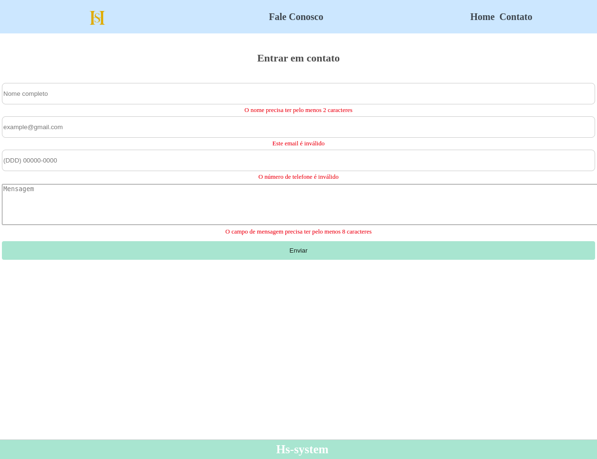

<h1 align="center"> Projeto de Interfaces React</h1>

Projeto desenvolvido para avaliação na disciplina de Interfaces React, ministrada pelo professor Alexandre durante a Pós Graduação em Desenvolvimento Web Full Stack.  

  <a href="#-tecnologias">Tecnologias</a>&nbsp;&nbsp;&nbsp;|&nbsp;&nbsp;&nbsp;
  <a href="#-projeto">Projeto</a>&nbsp;&nbsp;&nbsp;|&nbsp;&nbsp;&nbsp;
  <!-- <a href="#-layout">Layout</a>&nbsp;&nbsp;&nbsp;|&nbsp;&nbsp;&nbsp; -->
  <a href="#memo-licença">Licença</a>

  

 

Dashboard: 
 
  

Fale Conosco: 
 
  

## 🚀 Tecnologias

Esse projeto foi desenvolvido com as seguintes tecnologias:

- React
- Typescript
- Material UI
- React ChartJs
- Recharts
- React Router
- Styled Components
- Git e Github
- Vite

## 💻 Projeto

Anúncio de um sofá que é possivel visualiza-lo em 360.

- [Acesse o projeto finalizado, online](https://github.com/HenriqueMVSS/Hs-Admin-React)

Para rodar o projeto:

Através de algum terminal execute o seguinte comando:  
`git clone https://github.com/HenriqueMVSS/Hs-Admin-React`

Após concluir o clone do repositório:  

Roda `npm install` para instalar as dependências do projeto.

<!-- ## 🔖 Layout

Você pode visualizar o layout do projeto através [DESSE LINK](https://www.figma.com/file/4uTyNwnKfXhwiMK9ERqZnF/%23boraCodar---Desafio-2-(Community)?node-id=103%3A95&t=BJaw8OjvfXu65bRF-0). É necessário ter conta no [Figma](https://figma.com) para acessá-lo. -->

## :memo: Licença

Esse projeto está sob a licença MIT.

---
